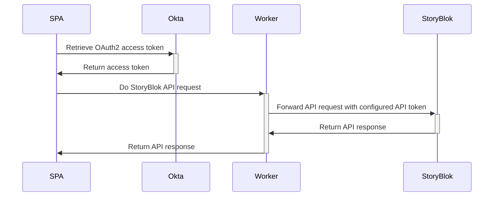

# StoryBlok proxy as a Cloudflare worker

This worker acts as a middleman between the SPA frontend and the StoryBlok API. Because of the SPA nature the StoryBlok
API key is exposed in the frontend code. This is not secure.

This worker stores API keys per SPA host origin so all StoryBlok API calls be requested here. The requests however do
need an OAuth2 JWT Bearer token as an Authorization header. Use Okta OAuth2 to sign the requests to this worker.


## Architecture

- SPA: Can be a Vue or React SPA deployed to Cloudflare
- Okta: The OAuth2 identity provider
- Worker: This StoryBlok-proxy worker deployed to Cloudflare
- StoryBlok: External CMS provided API




## Configuring the worker

See the file .env.example for all the environment variables that need to be set in Cloudflare.

The env `STORYBLOK_HOST` needs the default api host `https://api.storyblok.com/v2`.

The env `STORYBLOK_ORIGIN_TOKENS` is a base64 encoded JSON string `'[{"token":"changeme","regex":"^.+localhost:3000.*$"}]'` . It is an array of objects with keys token (The StoryBlok API key) and regex pattern. It needs to be base64 encoded. The regex pattern is used to match the Origin header of the request.

```sh
echo '[{"token":"changeme","regex":"^.+localhost:3000.*$"}]' | base64
```

> The regex pattern matches with the Origin header on all requests. Make sure your regexes are specific enough as not
> to match with multiple tokens.
